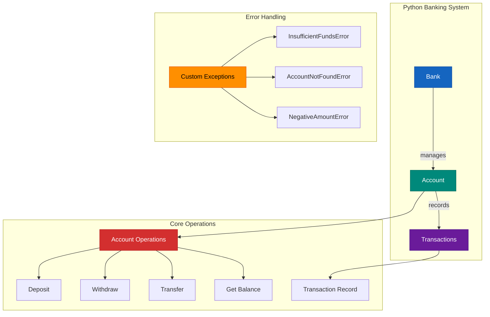

# In-Memory Banking System


A high-performance, in-memory banking system backend built with **Python** and **FastAPI**. Designed for demonstration, it showcases best practices in concurrent programming (Asyncio), RESTful API design, and containerization (Docker).

## Features

- ** High Performance**: Pure in-memory operations with **O(1)** lookup times.
- ** Concurrency Safe**: Uses Python's `asyncio` single-threaded event loop to handle concurrent requests safely without locks.
- ** Docker Ready**: Containerized for easy deployment to any cloud platform (Render, AWS, GCP).
- ** Robust Error Handling**: Custom exceptions for domain-specific errors (Insufficient Funds, Account Not Found, etc.).
- ** Comprehensive Testing**: 100% test coverage with **PyTest** and **GitHub Actions** CI/CD.

## Architecture

The system follows a clean architecture separating the domain model from the API layer.



## Tech Stack

- **Language**: Python 3.9+
- **Framework**: FastAPI
- **Concurrency**: Asyncio
- **Containerization**: Docker & Docker Compose
- **Testing**: PyTest, HTTPX
- **CI/CD**: GitHub Actions

---

## Getting Started

### Prerequisites

- Python 3.9+
- Docker (optional, for containerized execution)

### 1. Clone the repository

```bash
git clone https://github.com/WideSu/banking_system_backend.git
cd banking_system_backend
```

### 2. Run with Docker (Recommended)

The easiest way to run the application is using Docker Compose.

```bash
docker-compose up --build
```

The API Docs will be available at:
- **Interactive Docs**: https://banking-system-backend-klt3.onrender.com/docs

### 3. Run Locally (Manual)

Set up a virtual environment and install dependencies.

```bash
# Create and activate virtual environment
python3 -m venv venv
source venv/bin/activate  # On Windows: venv\Scripts\activate

# Install dependencies
pip install -r requirements.txt

# Run the server
python -m banking.main
```

## Testing

We maintain **100% code coverage**. You can run the test suite using PyTest.

```bash
# Run all tests
python -m pytest

# Run with coverage report
python -m pytest --cov=banking --cov-report=term-missing
```

## Project Structure

```
banking_system_backend/
├── banking/              # Core Application Code
│   ├── models.py         # Domain Logic (Bank, Account)
│   ├── main.py           # FastAPI Application & Routes
│   └── errors.py         # Custom Exception Classes
├── tests/                # Test Suite
│   ├── performance/      # Load & Stress Tests
│   ├── test_main.py      # API Integration Tests
│   └── test_models.py    # Unit Tests
├── docs/                 # Documentation
├── Dockerfile            # Docker Configuration
├── docker-compose.yml    # Docker Compose Configuration
└── requirements.txt      # Project Dependencies
```

## Contributing

Contributions are welcome! Please feel free to submit a Pull Request.

1. Fork the Project
2. Create your Feature Branch (`git checkout -b feature/AmazingFeature`)
3. Commit your Changes (`git commit -m 'Add some AmazingFeature'`)
4. Push to the Branch (`git push origin feature/AmazingFeature`)
5. Open a Pull Request

## License

This project is licensed under the MIT License - see the [LICENSE](LICENSE) file for details.
