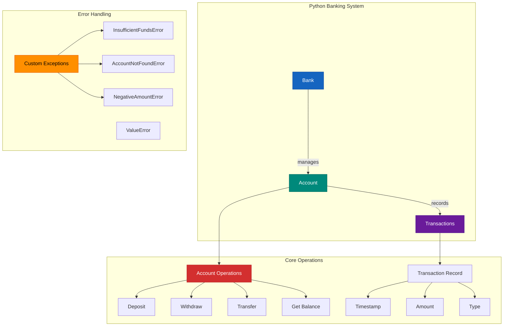

# 🏦 In-Memory Banking System

A minimal banking system implementation designed for demonstration purposes, featuring:
- Account Management:
    - Bank account creation with initial balance
    - Support for multiple users (one account per user)
- Core Banking Operations:
    - Deposits and withdrawals (no overdraft, and check invalid deposit/withdraw amount)
    - Inter-account fund transfers
    - Complete transaction history tracking

- Technical Characteristics:
    - Pure in-memory operation (no persistent storage)
    - Custom exception handling for banking-specific errors
    - GitHub CICD for install, lint, build, unit test coverage check
    - Lint check for any unused import


---

## ⚙️ Tech Stack
- **Python** (3.10+)
- **FastAPI** (RESTful API)
- **PyTest** (unit testing)
- **Python venv** (virtual environment)
- **GitHub Actions** (CI/CD pipeline for install, lint, build, test coverage check>=98%)

---

## ✨ Features and Implementation

- ✅ Create users and accounts with an initial balance
- ✅ Each user may have **one** account (assumed)
    - Accounts are stored using **Dictionary** in {'name':'balance'} pair
    - ⚠️ One user multiple accounts requires authentications which obeys **KISS principle**
    - We assume that there is only **one currency** for simplicity.
- ✅ Deposit funds into any owned account
- ✅ Withdraw funds (no overdraft allowed)
    - Invalid operations trigger appropriate custom exceptions (`InsufficientFundsError`, `AccountNotFoundError`, `NegativeAmountError`) with contextual error messages, while `ValueError` handles general parameter validation.
- ✅ Transfer funds between accounts 
- ✅ View account transaction history
    - Transaction records are stored in **List**

---

## Code Structure

```
banking_system/
├── banking/                      # Core application package
│   ├── __init__.py               # Package initialization
│   ├── models.py                 # Main banking logic (Account, Bank classes)
│   └── main.py                   # Main restful API logic
│
├── tests/                        # All test files
│   ├── __init__.py               # Test package initialization
│   ├──── test_models.py          # Basic functionality tests
│   ├──── test_main.py            # Basic API tests
│   │
│   └── performance/              # Performance tests
│       ├── __init__.py
│       └── stress_test.py        # Stress/load testing
│
├── img/                          # Image used in README file
│   └── stress_test_result(10M).png # Stress test result
│
├── .gitignore                    # Ignores .DS_Store, __pycache__, etc.
├── requirements.txt              # Dependencies
└── README.md                     # Project documentation
```

---

## 🚀 Getting Started

### 1. Clone the repository

```bash
git clone https://github.com/WideSu/banking_system_backend.git
cd banking-system
```

### 2. Set up the virtual environment
Run the command below in console
```bash
python -m venv venv
source venv/bin/activate      # On Windows: venv\Scripts\activate
pip install -r requirements.txt
```

### 3. Example Usage
You can run an interactive session like this:
```python
>>> from banking.core import *
>>> bank = Bank()
>>> account = bank.create_account("Alice", 100.0)
>>> account.deposit(500)
>>> account.withdraw(200)
>>> account.get_transaction_history()
```

Example output:
```bash
['Account created with balance: 100.00', 'Deposited: 500.00', 'Withdrawn: 200.00']
```
### 4. Run Unit Tests
#### 4.1 Test coverage
Run the command below in console to show the unit test result with coverage
```bash
pytest --cov=banking tests/
```
Example output:
```bash
======================================== test session starts ========================================
platform darwin -- Python 3.10.9, pytest-8.3.5, pluggy-1.5.0
rootdir: /Users/huanganni/Documents/GitHub/banking_system
plugins: anyio-4.9.0
collected 22 items                                                                                                                                                                    

tests/test_main.py ........                                                                                                                                                     [ 36%]
tests/test_models.py ..............                                                                                                                                             [100%]

======================================== 22 passed in 0.30s =========================================
Name                  Stmts   Miss  Cover   Missing
---------------------------------------------------
banking/__init__.py       0      0   100%
banking/errors.py         6      0   100%
banking/main.py          55      0   100%
banking/models.py        50      0   100%
---------------------------------------------------
TOTAL                   111      0   100%

```
#### 4.2 With log for each test case (execuetion time, result)
Run the command below in console
```bash
pytest --log-cli-level=INFO -v
```
Example output:
```bash
======================================== test session starts ========================================
platform darwin -- Python 3.10.9, pytest-8.3.5, pluggy-1.5.0 -- /Users/huanganni/Documents/GitHub/banking_system/venv/bin/python3
cachedir: .pytest_cache
rootdir: /Users/huanganni/Documents/GitHub/banking_system
plugins: anyio-4.9.0
collected 21 items                                                                                                                                                                    

tests/test_main.py::test_create_account_success 
---------------------------------------- live log call ----------------------------------------
INFO     httpx:_client.py:1025 HTTP Request: POST http://testserver/accounts/ "HTTP/1.1 200 OK"
PASSED                                                                                                                                                                          [  4%]
tests/test_main.py::test_create_account_negative_balance 
---------------------------------------- live log call ----------------------------------------
INFO     httpx:_client.py:1025 HTTP Request: POST http://testserver/accounts/ "HTTP/1.1 400 Bad Request"
PASSED                                                                                                                                                                          [  9%]
tests/test_main.py::test_get_balance_existing 
---------------------------------------- live log call ----------------------------------------
INFO     httpx:_client.py:1025 HTTP Request: POST http://testserver/accounts/ "HTTP/1.1 200 OK"
INFO     httpx:_client.py:1025 HTTP Request: GET http://testserver/accounts/carol "HTTP/1.1 200 OK"
PASSED                                                                                                                                                                          [ 14%]
tests/test_main.py::test_get_balance_not_found 
---------------------------------------- live log call ----------------------------------------
INFO     httpx:_client.py:1025 HTTP Request: GET http://testserver/accounts/doesnotexist "HTTP/1.1 404 Not Found"
PASSED                                                                                                                                                                          [ 19%]
tests/test_main.py::test_deposit_success 
---------------------------------------- live log call ----------------------------------------
INFO     httpx:_client.py:1025 HTTP Request: POST http://testserver/accounts/ "HTTP/1.1 200 OK"
INFO     httpx:_client.py:1025 HTTP Request: POST http://testserver/deposit "HTTP/1.1 200 OK"
INFO     httpx:_client.py:1025 HTTP Request: GET http://testserver/accounts/dan "HTTP/1.1 200 OK"
PASSED                                                                                                                                                                          [ 23%]
tests/test_main.py::test_deposit_negative_amount 
---------------------------------------- live log call ----------------------------------------
INFO     httpx:_client.py:1025 HTTP Request: POST http://testserver/accounts/ "HTTP/1.1 200 OK"
INFO     httpx:_client.py:1025 HTTP Request: POST http://testserver/deposit "HTTP/1.1 400 Bad Request"
PASSED                                                                                                                                                                          [ 28%]
tests/test_main.py::test_withdraw_success_and_insufficient 
---------------------------------------- live log call ----------------------------------------
INFO     httpx:_client.py:1025 HTTP Request: POST http://testserver/accounts/ "HTTP/1.1 200 OK"
INFO     httpx:_client.py:1025 HTTP Request: POST http://testserver/withdraw "HTTP/1.1 200 OK"
INFO     httpx:_client.py:1025 HTTP Request: POST http://testserver/withdraw "HTTP/1.1 400 Bad Request"
PASSED                                                                                                                                                                          [ 33%]
tests/test_main.py::test_transfer_success_and_errors 
---------------------------------------- live log call ----------------------------------------
INFO     httpx:_client.py:1025 HTTP Request: POST http://testserver/accounts/ "HTTP/1.1 200 OK"
INFO     httpx:_client.py:1025 HTTP Request: POST http://testserver/accounts/ "HTTP/1.1 200 OK"
INFO     httpx:_client.py:1025 HTTP Request: POST http://testserver/transfer "HTTP/1.1 200 OK"
INFO     httpx:_client.py:1025 HTTP Request: GET http://testserver/accounts/gina "HTTP/1.1 200 OK"
INFO     httpx:_client.py:1025 HTTP Request: GET http://testserver/accounts/hank "HTTP/1.1 200 OK"
INFO     httpx:_client.py:1025 HTTP Request: POST http://testserver/transfer "HTTP/1.1 400 Bad Request"
INFO     httpx:_client.py:1025 HTTP Request: POST http://testserver/transfer "HTTP/1.1 400 Bad Request"
PASSED                                                                                                                                                                          [ 38%]
tests/test_models.py::test_account_creation 
---------------------------------------- live log call ----------------------------------------
INFO     tests.test_models:test_models.py:25 🚀 Starting test: test_account_creation
INFO     tests.test_models:test_models.py:33 ✅ Test passed in 0.0001s: test_account_creation
PASSED                                                                                                                                                                          [ 42%]
tests/test_models.py::test_deposit 
---------------------------------------- live log call ----------------------------------------
INFO     tests.test_models:test_models.py:25 🚀 Starting test: test_deposit
INFO     tests.test_models:test_models.py:33 ✅ Test passed in 0.0001s: test_deposit
PASSED                                                                                                                                                                          [ 47%]
tests/test_models.py::test_withdraw 
---------------------------------------- live log call ----------------------------------------
INFO     tests.test_models:test_models.py:25 🚀 Starting test: test_withdraw
INFO     tests.test_models:test_models.py:33 ✅ Test passed in 0.0001s: test_withdraw
PASSED                                                                                                                                                                          [ 52%]
tests/test_models.py::test_withdraw_insufficient_funds 
---------------------------------------- live log call ----------------------------------------
INFO     tests.test_models:test_models.py:25 🚀 Starting test: test_withdraw_insufficient_funds
INFO     tests.test_models:test_models.py:33 ✅ Test passed in 0.0001s: test_withdraw_insufficient_funds
PASSED                                                                                                                                                                          [ 57%]
tests/test_models.py::test_negative_deposit 
---------------------------------------- live log call ----------------------------------------
INFO     tests.test_models:test_models.py:25 🚀 Starting test: test_negative_deposit
INFO     tests.test_models:test_models.py:33 ✅ Test passed in 0.0001s: test_negative_deposit
PASSED                                                                                                                                                                          [ 61%]
tests/test_models.py::test_negative_withdraw 
---------------------------------------- live log call ----------------------------------------
INFO     tests.test_models:test_models.py:25 🚀 Starting test: test_negative_withdraw
INFO     tests.test_models:test_models.py:33 ✅ Test passed in 0.0001s: test_negative_withdraw
PASSED                                                                                                                                                                          [ 66%]
tests/test_models.py::test_transfer_successful 
---------------------------------------- live log call ----------------------------------------
INFO     tests.test_models:test_models.py:25 🚀 Starting test: test_transfer_successful
INFO     tests.test_models:test_models.py:33 ✅ Test passed in 0.0001s: test_transfer_successful
PASSED                                                                                                                                                                          [ 71%]
tests/test_models.py::test_transfer_to_self 
---------------------------------------- live log call ----------------------------------------
INFO     tests.test_models:test_models.py:25 🚀 Starting test: test_transfer_to_self
INFO     tests.test_models:test_models.py:33 ✅ Test passed in 0.0001s: test_transfer_to_self
PASSED                                                                                                                                                                          [ 76%]
tests/test_models.py::test_create_account 
---------------------------------------- live log call ----------------------------------------
INFO     tests.test_models:test_models.py:25 🚀 Starting test: test_create_account
INFO     tests.test_models:test_models.py:33 ✅ Test passed in 0.0001s: test_create_account
PASSED                                                                                                                                                                          [ 80%]
tests/test_models.py::test_create_duplicate_account 
---------------------------------------- live log call ----------------------------------------
INFO     tests.test_models:test_models.py:25 🚀 Starting test: test_create_duplicate_account
INFO     tests.test_models:test_models.py:33 ✅ Test passed in 0.0001s: test_create_duplicate_account
PASSED                                                                                                                                                                          [ 85%]
tests/test_models.py::test_create_account_negative_balance 
---------------------------------------- live log call ----------------------------------------
INFO     tests.test_models:test_models.py:25 🚀 Starting test: test_create_account_negative_balance
INFO     tests.test_models:test_models.py:33 ✅ Test passed in 0.0000s: test_create_account_negative_balance
PASSED                                                                                                                                                                          [ 90%]
tests/test_models.py::test_get_account_success 
---------------------------------------- live log call ----------------------------------------
INFO     tests.test_models:test_models.py:25 🚀 Starting test: test_get_account_success
INFO     tests.test_models:test_models.py:33 ✅ Test passed in 0.0000s: test_get_account_success
PASSED                                                                                                                                                                          [ 95%]
tests/test_models.py::test_get_account_not_found 
---------------------------------------- live log call ----------------------------------------
INFO     tests.test_models:test_models.py:25 🚀 Starting test: test_get_account_not_found
INFO     tests.test_models:test_models.py:33 ✅ Test passed in 0.0000s: test_get_account_not_found
PASSED                                                                                                                                                                          [100%]

======================================== 21 passed in 0.22s ========================================
```

#### 4.3 Without log info (an overview of the results for all tests)
Run the command below in console
```bash
pytest -v
```

Example output:
```bash
========================================= test session starts ========================================
platform darwin -- Python 3.10.9, pytest-8.3.5, pluggy-1.5.0 -- /Users/huanganni/Documents/GitHub/banking_system/venv/bin/python3
cachedir: .pytest_cache
rootdir: /Users/huanganni/Documents/GitHub/banking_system
plugins: anyio-4.9.0
collected 21 items                                                                                                                                                                    

tests/test_main.py::test_create_account_success PASSED                                                                                                                          [  4%]
tests/test_main.py::test_create_account_negative_balance PASSED                                                                                                                 [  9%]
tests/test_main.py::test_get_balance_existing PASSED                                                                                                                            [ 14%]
tests/test_main.py::test_get_balance_not_found PASSED                                                                                                                           [ 19%]
tests/test_main.py::test_deposit_success PASSED                                                                                                                                 [ 23%]
tests/test_main.py::test_deposit_negative_amount PASSED                                                                                                                         [ 28%]
tests/test_main.py::test_withdraw_success_and_insufficient PASSED                                                                                                               [ 33%]
tests/test_main.py::test_transfer_success_and_errors PASSED                                                                                                                     [ 38%]
tests/test_models.py::test_account_creation PASSED                                                                                                                              [ 42%]
tests/test_models.py::test_deposit PASSED                                                                                                                                       [ 47%]
tests/test_models.py::test_withdraw PASSED                                                                                                                                      [ 52%]
tests/test_models.py::test_withdraw_insufficient_funds PASSED                                                                                                                   [ 57%]
tests/test_models.py::test_negative_deposit PASSED                                                                                                                              [ 61%]
tests/test_models.py::test_negative_withdraw PASSED                                                                                                                             [ 66%]
tests/test_models.py::test_transfer_successful PASSED                                                                                                                           [ 71%]
tests/test_models.py::test_transfer_to_self PASSED                                                                                                                              [ 76%]
tests/test_models.py::test_create_account PASSED                                                                                                                                [ 80%]
tests/test_models.py::test_create_duplicate_account PASSED                                                                                                                      [ 85%]
tests/test_models.py::test_create_account_negative_balance PASSED                                                                                                               [ 90%]
tests/test_models.py::test_get_account_success PASSED                                                                                                                           [ 95%]
tests/test_models.py::test_get_account_not_found PASSED                                                                                                                         [100%]

======================================== 21 passed in 0.22s ========================================
                                                    
```

### 4. Stress Test
In the stress test, this system has **85s** delay and **272.07MB** peak memory usage for **10M transactions**. 

For **1M transactions**, this system have a delay of **7.7s** and **272MB** peak memory usage.

To run the stress test, you can run the command below in console
```bash
python -m tests.stress_test
```
Key Metrics to Monitor
- **Throughput**: Transactions per second (Txn/s)
- **Latency**: Time to complete all transactions
- **Memory Usage**: RAM consumption during test
- Error Rate: Failed transactions percentage


Example result:
| Transactions | Time (s) | Txn/s      | Peak MB |
|--------------|----------|------------|---------|
| 1,000        | 0.0101   | 99,009.08  | 0.28    |
| 2,000        | 0.0178   | 112,161.06 | 0.55    |
| 3,000        | 0.0238   | 125,969.04 | 0.82    |
| 5,000        | 0.0398   | 125,534.70 | 1.37    |
| 10,000       | 0.0775   | 128,955.16 | 2.74    |
| 20,000       | 0.1525   | 131,156.07 | 5.46    |
| 50,000       | 0.3860   | 129,528.03 | 13.67   |
| 100,000      | 0.7672   | 130,352.21 | 27.44   |
| 200,000      | 1.5435   | 129,573.81 | 54.92   |
| 500,000      | 3.8480   | 129,936.59 | 135.87  |
| 1,000,000    | 7.7345   | 129,290.81 | 272.07  |
| 2,000,000    | 15.6827  | 127,529.10 | 545.03  |
| 5,000,000    | 40.6245  | 123,078.39 | 1,366.62|
| 10,000,000   | 85.0875  | 117,526.14 | 2,737.18|
| 20,000,000   | 170.7883 | 117,104.01 | 5,481.01|

## 🤔 To do(Advanced)
- Should I add API endpoint for it? (e.g. FastAPI)

- Should I handle concurrency?
    - I don’t need to handle concurrency right now if you're only calling methods in sequence (e.g., CLI scripts, single-threaded simulation).
    - But if we're planning to:
        - Expose it as a web service,
        - Load test it,
        - Or run it in production or multi-user simulation,
    - Then we should start thinking about thread-safety.
- What if someone is making a lot of transactions and blocking others?
    - Add per-account locks, retry logic, and rate limiting together to ensure safety and fairness.