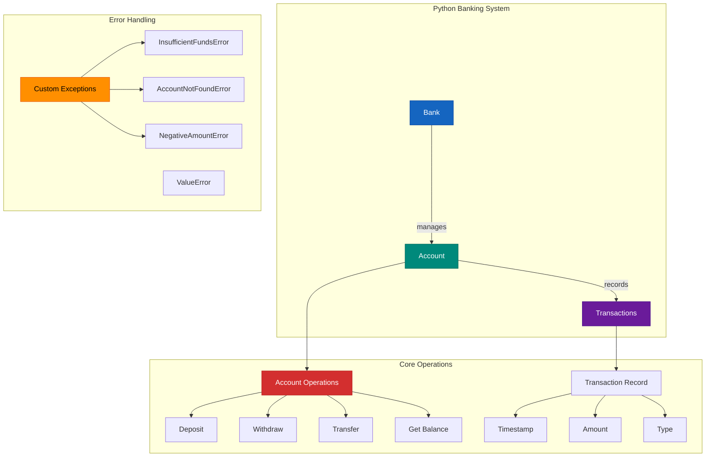

# 🏦 In-Memory Banking System

A minimal banking system implementation designed for demonstration purposes, featuring:
- Account Management:
    - Bank account creation with initial balance
    - Support for multiple users (one account per user)
- Core Banking Operations:
    - Deposits and withdrawals (no overdraft, and check invalid deposit/withdraw amount)
    - Inter-account fund transfers
    - Complete transaction history tracking

- Technical Characteristics:
    - Pure in-memory operation (no persistent storage)
    - Custom exception handling for banking-specific errors
    - Clean Python implementation


---

## ⚙️ Tech Stack

- **Python** (3.10+)
- **PyTest** (unit testing)
- **Python venv** (virtual environment)
- **GitHub Actions** (CI/CD pipeline for install, lint, build, test coverage check>=98%)

---

## ✨ Features and Implementation

- ✅ Create users and accounts with an initial balance
- ✅ Each user may have **one** account (assumed)
    - Accounts are stored using **Dictionary** in {'name':'balance'} pair
    - ⚠️ One user multiple accounts requires authentications which obeys KISS principle
- ✅ Deposit funds into any owned account
- ✅ Withdraw funds (no overdraft allowed)
    - Invalid operations trigger appropriate custom exceptions (`InsufficientFundsError`, `AccountNotFoundError`, `NegativeAmountError`) with contextual error messages, while `ValueError` handles general parameter validation.
- ✅ Transfer funds between accounts 
- ✅ View account transaction history
    - Transaction records are stored in **List**

---

## Code Structure

```
banking_system/
├── LICENSE
├── README.md
├── banking                 # Python package
│   ├── __init__.py         # Empty file to make it a package
│   └── core.py             # Our main banking code
├── requirements.txt
└── tests
    └── test_banking.py     # Our test file
```

---

## 🚀 Getting Started

### 1. Clone the repository

```bash
git clone https://github.com/WideSu/banking_system_backend.git
cd banking-system

### 2. Set up the virtual environment
Run the command below in console
```bash
python -m venv venv
source venv/bin/activate      # On Windows: venv\Scripts\activate
pip install -r requirements.txt
```

### 2. Example Use
You can run an interactive session like this:
```python
>>> from banking.core import *
>>> bank = Bank()
>>> account = bank.create_account("Alice", 100.0)
>>> account.deposit(500)
>>> account.withdraw(200)
>>> account.get_transaction_history()
```

Example output:
```bash
['Account created with balance: 100.00', 'Deposited: 500.00', 'Withdrawn: 200.00']
```
### 3. Run Unit Tests
- 1. Test coverage
Run the command below in console
```bash
pytest --cov=banking tests/
```
Example output:
```bash
======================================= test session starts =======================================
platform darwin -- Python 3.10.9, pytest-8.3.5, pluggy-1.5.0
rootdir: /Users/huanganni/Documents/GitHub/banking_system
plugins: cov-6.1.1
collected 13 items                                                                                                                                                                    

tests/test_banking.py .............                                                                                                                                             [100%]

========================================= tests coverage =========================================
________________________________ coverage: platform darwin, python 3.10.9-final-0 _________________________________

Name                  Stmts   Miss  Cover   Missing
------
banking/__init__.py       0      0   100%
banking/core.py          55      0   100%
------
TOTAL                    55      0   100%
======================================= 13 passed in 0.03s ========================================
```
- 2. With log for each test case (execuetion time, result)
Run the command below in console
```bash
pytest --log-cli-level=INFO -v
```
Example output:
```bash
======================================= test session starts =======================================
platform darwin -- Python 3.10.9, pytest-8.3.5, pluggy-1.5.0 -- /Users/huanganni/Documents/GitHub/banking_system/venv/bin/python
cachedir: .pytest_cache
rootdir: /Users/huanganni/Documents/GitHub/banking_system
plugins: cov-6.1.1
collected 13 items                                                                                                                                                                    

tests/test_banking.py::test_account_creation 
--------------------------------------- live log call ---------------------------------------
INFO     test_banking:test_banking.py:19 🚀 Starting test: test_account_creation
INFO     test_banking:test_banking.py:22 ✅ Test passed: test_account_creation
PASSED                                                                                                                                                                          [  7%]
tests/test_banking.py::test_deposit 
--------------------------------------- live log call ---------------------------------------
INFO     test_banking:test_banking.py:19 🚀 Starting test: test_deposit
INFO     test_banking:test_banking.py:22 ✅ Test passed: test_deposit
PASSED                                                                                                                                                                          [ 15%]
tests/test_banking.py::test_withdraw 
--------------------------------------- live log call ---------------------------------------
INFO     test_banking:test_banking.py:19 🚀 Starting test: test_withdraw
INFO     test_banking:test_banking.py:22 ✅ Test passed: test_withdraw
PASSED                                                                                                                                                                          [ 23%]
tests/test_banking.py::test_withdraw_insufficient_funds 
--------------------------------------- live log call ---------------------------------------
INFO     test_banking:test_banking.py:19 🚀 Starting test: test_withdraw_insufficient_funds
INFO     test_banking:test_banking.py:22 ✅ Test passed: test_withdraw_insufficient_funds
PASSED                                                                                                                                                                          [ 30%]
tests/test_banking.py::test_negative_deposit 
--------------------------------------- live log call ---------------------------------------
INFO     test_banking:test_banking.py:19 🚀 Starting test: test_negative_deposit
INFO     test_banking:test_banking.py:22 ✅ Test passed: test_negative_deposit
PASSED                                                                                                                                                                          [ 38%]
tests/test_banking.py::test_negative_withdraw 
--------------------------------------- live log call ---------------------------------------
INFO     test_banking:test_banking.py:19 🚀 Starting test: test_negative_withdraw
INFO     test_banking:test_banking.py:22 ✅ Test passed: test_negative_withdraw
PASSED                                                                                                                                                                          [ 46%]
tests/test_banking.py::test_transfer_successful 
--------------------------------------- live log call ---------------------------------------
INFO     test_banking:test_banking.py:19 🚀 Starting test: test_transfer_successful
INFO     test_banking:test_banking.py:22 ✅ Test passed: test_transfer_successful
PASSED                                                                                                                                                                          [ 53%]
tests/test_banking.py::test_transfer_to_self 
--------------------------------------- live log call ---------------------------------------
INFO     test_banking:test_banking.py:19 🚀 Starting test: test_transfer_to_self
INFO     test_banking:test_banking.py:22 ✅ Test passed: test_transfer_to_self
PASSED                                                                                                                                                                          [ 61%]
tests/test_banking.py::test_create_account 
--------------------------------------- live log call ---------------------------------------
INFO     test_banking:test_banking.py:19 🚀 Starting test: test_create_account
INFO     test_banking:test_banking.py:22 ✅ Test passed: test_create_account
PASSED                                                                                                                                                                          [ 69%]
tests/test_banking.py::test_create_duplicate_account 
--------------------------------------- live log call ---------------------------------------
INFO     test_banking:test_banking.py:19 🚀 Starting test: test_create_duplicate_account
INFO     test_banking:test_banking.py:22 ✅ Test passed: test_create_duplicate_account
PASSED                                                                                                                                                                          [ 76%]
tests/test_banking.py::test_create_account_negative_balance 
--------------------------------------- live log call ---------------------------------------
INFO     test_banking:test_banking.py:19 🚀 Starting test: test_create_account_negative_balance
INFO     test_banking:test_banking.py:22 ✅ Test passed: test_create_account_negative_balance
PASSED                                                                                                                                                                          [ 84%]
tests/test_banking.py::test_get_account_success 
--------------------------------------- live log call ---------------------------------------
INFO     test_banking:test_banking.py:19 🚀 Starting test: test_get_account_success
INFO     test_banking:test_banking.py:22 ✅ Test passed: test_get_account_success
PASSED                                                                                                                                                                          [ 92%]
tests/test_banking.py::test_get_account_not_found 
--------------------------------------- live log call ---------------------------------------
INFO     test_banking:test_banking.py:19 🚀 Starting test: test_get_account_not_found
INFO     test_banking:test_banking.py:22 ✅ Test passed: test_get_account_not_found
PASSED                                                                                                                                                                          [100%]
```

- 3. Without log info (an overview of the results for all tests)
Run the command below in console
```bash
pytest -v
```

Example output:
```bash
========================================= test session starts =========================================
platform darwin -- Python 3.10.9, pytest-8.3.5, pluggy-1.5.0 -- /Users/huanganni/Documents/GitHub/banking_system/venv/bin/python
cachedir: .pytest_cache
rootdir: /Users/huanganni/Documents/GitHub/banking_system
plugins: cov-6.1.1
collected 13 items                                                                                                                                                                    

tests/test_banking.py::test_account_creation PASSED                                                                                                                             [  7%]
tests/test_banking.py::test_deposit PASSED                                                                                                                                      [ 15%]
tests/test_banking.py::test_withdraw PASSED                                                                                                                                     [ 23%]
tests/test_banking.py::test_withdraw_insufficient_funds PASSED                                                                                                                  [ 30%]
tests/test_banking.py::test_negative_deposit PASSED                                                                                                                             [ 38%]
tests/test_banking.py::test_negative_withdraw PASSED                                                                                                                            [ 46%]
tests/test_banking.py::test_transfer_successful PASSED                                                                                                                          [ 53%]
tests/test_banking.py::test_transfer_to_self PASSED                                                                                                                             [ 61%]
tests/test_banking.py::test_create_account PASSED                                                                                                                               [ 69%]
tests/test_banking.py::test_create_duplicate_account PASSED                                                                                                                     [ 76%]
tests/test_banking.py::test_create_account_negative_balance PASSED                                                                                                              [ 84%]
tests/test_banking.py::test_get_account_success PASSED                                                                                                                          [ 92%]
tests/test_banking.py::test_get_account_not_found PASSED                                                                                                                        [100%]                                                      
```

### 4. Stress Test
In the stress test, this system has 85s delay and 272.07MB peak memory usage for 10M transactions. For 1M transactions, this system have a delay of 7.7s and 272MB peak memory usage.

To see the result, you can run the command below in console
```bash
python -m tests.stress_test
```
Key Metrics to Monitor
- **Throughput**: Transactions per second (Txn/s)
- **Latency**: Time to complete all transactions
- **Memory Usage**: RAM consumption during test
- Error Rate: Failed transactions percentage


Example result:
| Transactions | Time (s) | Txn/s      | Peak MB |
|--------------|----------|------------|---------|
| 1,000        | 0.0101   | 99,009.08  | 0.28    |
| 2,000        | 0.0178   | 112,161.06 | 0.55    |
| 3,000        | 0.0238   | 125,969.04 | 0.82    |
| 5,000        | 0.0398   | 125,534.70 | 1.37    |
| 10,000       | 0.0775   | 128,955.16 | 2.74    |
| 20,000       | 0.1525   | 131,156.07 | 5.46    |
| 50,000       | 0.3860   | 129,528.03 | 13.67   |
| 100,000      | 0.7672   | 130,352.21 | 27.44   |
| 200,000      | 1.5435   | 129,573.81 | 54.92   |
| 500,000      | 3.8480   | 129,936.59 | 135.87  |
| 1,000,000    | 7.7345   | 129,290.81 | 272.07  |
| 2,000,000    | 15.6827  | 127,529.10 | 545.03  |
| 5,000,000    | 40.6245  | 123,078.39 | 1,366.62|
| 10,000,000   | 85.0875  | 117,526.14 | 2,737.18|
| 20,000,000   | 170.7883 | 117,104.01 | 5,481.01|