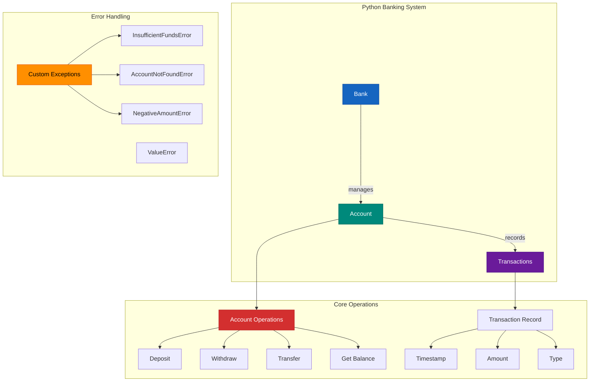
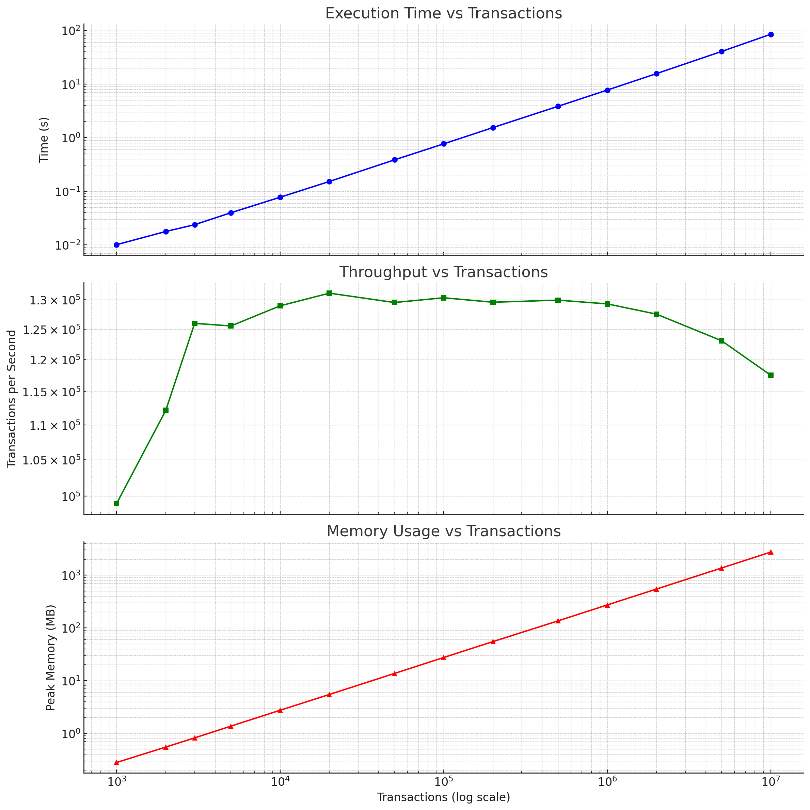

# 🏦 In-Memory Banking System
A minimal banking system implementation designed for demonstration purposes, featuring:
- Account Management:
    - Bank account creation with initial balance
    - Support for multiple users (one account per user)
- Core Banking Operations:
    - Deposits and withdrawals (no overdraft, and check invalid deposit/withdraw amount)
    - Inter-account fund transfers
    - Complete transaction history tracking

- Technical Characteristics:
    - Pure in-memory operation (no persistent storage)
    - Custom exception handling for banking-specific errors
    - GitHub CICD for install, lint, build, unit test coverage check
    - Lint check for any unused import
    - [RLock](https://docs.python.org/3/library/threading.html#rlock-objects) makes it safe to call methods like withdraw, deposit and transfer


---

## ⚙️ Tech Stack
- **Python** (3.10+)
- **FastAPI** (RESTful API)
- **PyTest** (unit testing)
- **Python venv** (virtual environment)
- **GitHub Actions** (CI/CD pipeline for install, lint, build, test coverage check>=98%)

---

## ✨ Features and Implementation

- ✅ Create users and accounts with an initial balance
- ✅ Each user may have **one** account (assumed)
    - Accounts are stored using **Dictionary** in {'name':'balance'} pair
    - ⚠️ One user multiple accounts requires authentications which obeys **KISS principle**
    - We assume that there is only **one currency** for simplicity.
- ✅ Deposit funds into any owned account
    - 🔒 Lock the account during deposit operations
- ✅ Withdraw funds (no overdraft allowed)
    - 🔒 Lock the account during withdraw operations
    - Invalid operations trigger appropriate custom exceptions (`InsufficientFundsError`, `AccountNotFoundError`, `NegativeAmountError`) with contextual error messages, while `ValueError` handles general parameter validation.
- ✅ Transfer funds between accounts
    - 🔒 Lock both accounts during withdraw operations
- ✅ View account transaction history
    - Transaction records are stored in **List**

---

## Code Structure

```
banking_system/
├── banking/                      # Core application package
│   ├── __init__.py               # Package initialization
│   ├── models.py                 # Main banking logic (Account, Bank classes)
│   └── main.py                   # Main restful API logic
│
├── tests/                        # All test files
│   ├── __init__.py               # Test package initialization
│   ├──── test_models.py          # Basic functionality tests
│   ├──── test_main.py            # Basic API tests
│   ├──── test_logger.py          # Log the execuetion time and test info by decorator
│   └── performance/              # Performance tests
│       ├── __init__.py
│       └── stress_test.py        # Stress/load testing
│
├── img/                          # Image used in README file
│   └── stress_test_result(10M).png # Stress test result
├── docs/                         # Documentation for other topics
│   ├── EndPoints.md              # API reference documentation
│   ├── FutureWork.md             # Record the things I am working on 
│   └── UnitTest.py               # Command to run unit tests
│
├── .gitignore                    # Ignores .DS_Store, __pycache__, etc.
├── requirements.txt              # Dependencies
└── README.md                     # Project documentation
```

---

## 🚀 Getting Started
### 1. Clone the repository

```bash
git clone https://github.com/WideSu/banking_system_backend.git
cd banking-system
```

### 2. Set up the virtual environment
Run the command below in console
```bash
python -m venv venv
source venv/bin/activate      # On Windows: venv\Scripts\activate
pip install -r requirements.txt
```

### 3. Example Usage
#### 3.1 Interactive python
You can run an interactive session like this in python interactive mode under main project directory(at the same level as requirements.txt):
```python
>>> from banking.core import *
>>> bank = Bank()
>>> account = bank.create_account("Alice", 100.0)
>>> account.deposit(500)
>>> account.withdraw(200)
>>> account.get_transaction_history()
```

Example output:
```bash
['Account created with balance: 100.00', 'Deposited: 500.00', 'Withdrawn: 200.00']
```

#### 3.2 API Endpoints
Or you can run the API using the commands below in console.
```
uvicorn main:app --reload
```
After that you will be able to use the api at http://localhost:8000/ and see the documentation at http://localhost:8000/docs#/

### 4. Performance
In the stress test, this system has **85s** delay and **272.07MB** peak memory usage for **10M transactions**. 

For **1M transactions**, this system have a delay of **7.7s** and **272MB** peak memory usage.

To run the stress test, you can run the command below in console
```bash
python -m tests.stress_test
```
Key Metrics to Monitor
- **Throughput**: Transactions per second (Txn/s)
- **Latency**: Time to complete all transactions
- **Memory Usage**: RAM consumption during test
- Error Rate: Failed transactions percentage



Example result:
| Transactions | Time (s) | Txn/s      | Peak MB |
|--------------|----------|------------|---------|
| 1,000        | 0.0101   | 99,009.08  | 0.28    |
| 2,000        | 0.0178   | 112,161.06 | 0.55    |
| 3,000        | 0.0238   | 125,969.04 | 0.82    |
| 5,000        | 0.0398   | 125,534.70 | 1.37    |
| 10,000       | 0.0775   | 128,955.16 | 2.74    |
| 20,000       | 0.1525   | 131,156.07 | 5.46    |
| 50,000       | 0.3860   | 129,528.03 | 13.67   |
| 100,000      | 0.7672   | 130,352.21 | 27.44   |
| 200,000      | 1.5435   | 129,573.81 | 54.92   |
| 500,000      | 3.8480   | 129,936.59 | 135.87  |
| 1,000,000    | 7.7345   | 129,290.81 | 272.07  |
| 2,000,000    | 15.6827  | 127,529.10 | 545.03  |
| 5,000,000    | 40.6245  | 123,078.39 | 1,366.62|
| 10,000,000   | 85.0875  | 117,526.14 | 2,737.18|
| 20,000,000   | 170.7883 | 117,104.01 | 5,481.01|

## Other things you may wanna know
- [API Reference](docs/EndPoints.md)
- [Unit Tests Commands and Results](docs/UnitTest.md)
- [Future Work(concurrency)](docs/FutureWork.md)
